### Work

I work at a fintech in Paris, on a Qt desktop client and a React web client. Most of
my time goes into shipping features on the application. I wrote the internal reverse
proxy in Rust, worker orchestration included. I'm running the migration of the older
MFC, ActiveX and Win32 layers off Windows and onto Linux through cross-compilation.

### Empire Earth

I reverse-engineer the game and I'm building a C++ modding framework on top of that
work, so that changing the game's behaviour doesn't require going through the
disassembly yourself. What I'm after is performance, stability, and a player count
that holds up on a game that gets older every year.

---

Both sides of this are heavily AI-assisted now, and I'd rather say so than pretend
otherwise. Finding a specific behaviour in disassembly, or in C++ nobody has read in
years, used to take me an afternoon. It takes minutes. Same for changing it. Knowing
what you're looking for is still the job, but everything around it got much cheaper.

The contribution graph below is missing most of my work. It happens in private
and org repositories.
